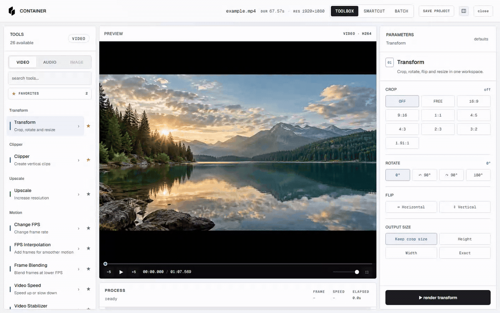

<h1 align="center">CONTAINER</h1>

  A Windows app for editing, converting and exporting video, audio and images. 
  It combines an FFmpeg toolbox, SmartCut, Clipper and batch processing.

  
  
  

  <a href="https://github.com/dewnn/container/releases/latest">Download the latest release</a> · <a href="https://github.com/dewnn/container/actions/workflows/ci.yml">Build status</a>

  

## Features

- Video, audio and image tools for conversion, resizing, cropping, speed, color, subtitles, overlays and export
- SmartCut silence detection with editable keep regions, timeline preview, MP4 and FCPXML export
- Clipper layouts, social tags and experimental automatic camera-region detection
- Batch processing, session recovery and hardware encoding with CPU fallback
- DWLNDR for supported downloads via bundled yt-dlp

Automatic camera-region detection is experimental. Review its selection before exporting.

## Install

Download `CONTAINER-Setup-<version>-x64.exe` from [Releases](https://github.com/dewnn/container/releases/latest). A portable ZIP is also available; extract it fully and keep its files together. Both packages include FFmpeg and FFprobe. The installer adds **Send to → CONTAINER** to Windows Explorer.

The app is not yet Authenticode-signed, so Windows SmartScreen may display an “Unknown publisher” warning.

## Behavior and privacy

Processing runs locally. CONTAINER does not upload media or collect analytics. Outputs are saved separately under `Downloads/CONTAINER Output`; source files are not overwritten.

Closing the window leaves CONTAINER in the notification area, allowing active jobs to continue. Use **Exit** from the tray menu to quit. Installed builds support signed updates; portable builds are updated manually.

See the [security notes](docs/SECURITY_AUDIT.md) for technical details.

## License and credits

CONTAINER is [MIT-licensed](LICENSE). FFmpeg and other bundled components retain their own licenses; see the [third-party notices](docs/THIRD_PARTY_NOTICES.md). SmartCut’s interface and Silero-based detection workflow were inspired by [cobanov/autocut](https://github.com/cobanov/autocut).

Built by **dewn**.
