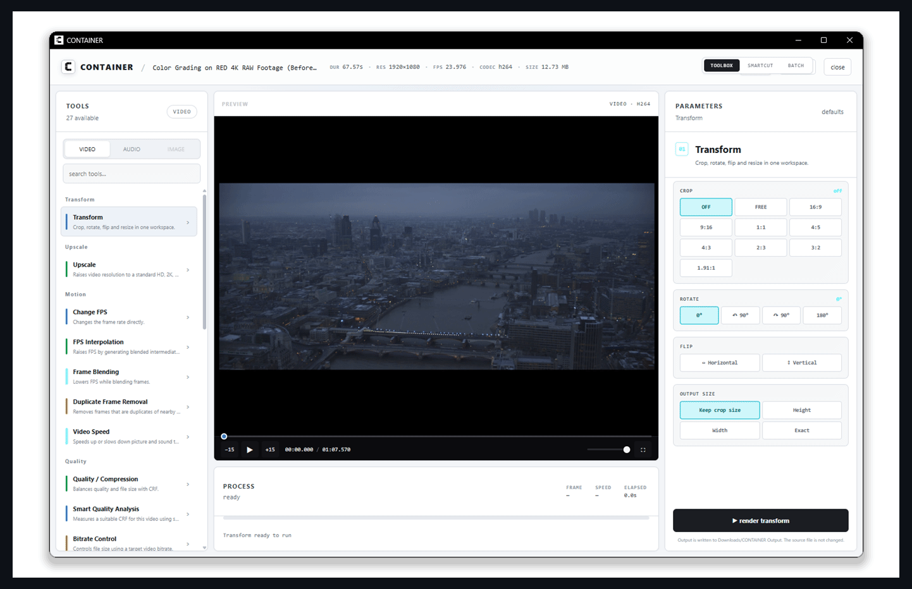

<h1 align="center">CONTAINER</h1>

  A local-first FFmpeg media toolbox for Windows. 
  Convert, edit, compress and smart-cut video, audio and images without uploading your files.

  
  
  

  <a href="#download">Download</a> ·
  <a href="#features">Features</a>

## What is CONTAINER?

CONTAINER brings practical FFmpeg workflows into one desktop app. The source file is never overwritten: every operation creates a new result under `Downloads/CONTAINER Output/<category>`.

Processing happens locally. CONTAINER does not upload your video, audio or images to a server.

## Features

### Toolbox

- Context-aware Video, Audio and Image categories with persistent favorites
- Ratio/crop, resize, FPS conversion, frame interpolation and frame blending
- Duplicate-frame removal, speed control and bitrate/quality controls
- Discord size-targeted compression and smart quality analysis
- Text overlays, color controls, noise, distortion and creative effects
- Cut, screenshot and GIF tools with precise visual timeline selection
- Audio extraction, replacement, removal and processing
- Social-media image crops (1:1, 4:5, 9:16, 16:9, 1.91:1, 2:3 and more) with lossless PNG or high-quality JPEG output
- Image conversion, scaling, quality reduction and before/after preview
- Hardware encoder detection with safe CPU fallback
- Batch workspace for repeated jobs
- Automatic work recovery after an unexpected shutdown
- One-click Output cleanup that moves generated files to the Recycle Bin
- Built-in DWLNDR workspace with bundled yt-dlp, link analysis and cancellable progress-aware downloads

### SmartCut

- Local Silero speech detection
- Automatic settings based on the selected recording
- Editable keep regions and cut-skipping preview
- Timeline navigation and external microphone/audio analysis
- MP4 export with quality and resolution presets
- FCPXML 1.11 timeline export
- Linked camera/audio tracks aligned from embedded timecode

## Download

Windows builds are published on the repository's **Releases** page:

- `CONTAINER-Setup-<version>-x64.exe` — recommended installer
- `CONTAINER-Portable-<version>-x64.zip` — portable folder (extract before running)

The Setup build also adds **Send to → CONTAINER** to Windows Explorer. Right-click a video, audio file or image and send it directly to CONTAINER. The shortcut is removed when the app is uninstalled; the Portable build does not modify this menu.

## FFmpeg included

Windows packages include the tested FFmpeg 9.0.1 full build and FFprobe. Users do not need to install FFmpeg, edit `PATH`, or run a package-manager command. The installer is the recommended download; the portable ZIP must be extracted with all files kept together.

Installed builds preserve this verified FFmpeg runtime separately from the app. Setup, in-app updates and Portable downloads include the tested media tools so every installation remains self-contained.

The app is currently not Authenticode-signed. Windows SmartScreen may therefore show an “Unknown publisher” warning until Windows code signing is added.

## yt-dlp included

Windows packages include a checksum-verified official yt-dlp build. DWLNDR works without a separate download and uses CONTAINER's bundled FFmpeg for video/audio merging. Because supported websites change frequently, the included build can still be replaced from the DWLNDR screen with a newer official executable.

FFmpeg, FFprobe and yt-dlp versions used by builds are pinned together in `config/bundled-tools.env`, preventing CI and release packages from silently drifting to untested binaries.

## Updates

Installed builds check for updates in the background when CONTAINER starts, without sending media or analytics. Updates can also be checked manually from the app and are verified before installation. The signed Setup package is used for in-app updates, so GitHub Releases do not expose a separate automatic-update executable. Portable builds should be replaced manually.

## Privacy and safety

- Media stays on your computer.
- Outputs are written to a new folder; the source is not modified.
- Hardware acceleration is used only when supported and falls back to CPU encoding.
- FFmpeg command failures are returned to the interface instead of silently replacing files.

Security design and verification notes are documented in [docs/SECURITY_AUDIT.md](docs/SECURITY_AUDIT.md).

## License and attribution

CONTAINER is released under the [MIT License](LICENSE).

SmartCut's interface and Silero-based voice-detection workflow were inspired by [cobanov/autocut](https://github.com/cobanov/autocut). Bundled FFmpeg remains licensed separately under GPLv3. See [third-party notices](docs/THIRD_PARTY_NOTICES.md) for dependency licenses and source links.

## Author

Built by **dewn** — vibe-coded with Codex.
