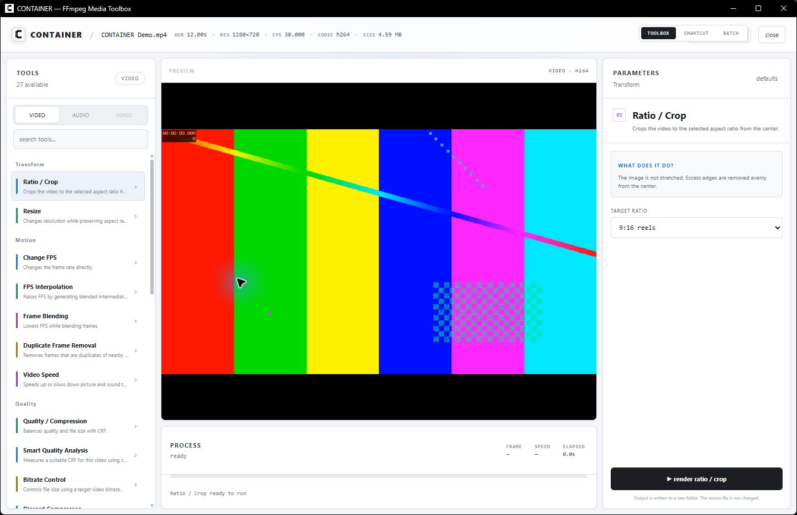

<h1 align="center">CONTAINER</h1>

<p align="center">
  A local-first FFmpeg media toolbox for Windows.<br>
  Convert, edit, compress and smart-cut video, audio and images without uploading your files.
</p>

<p align="center">
  <a href="https://github.com/dewnn/container/releases/latest"></a>
  <a href="https://github.com/dewnn/container/actions/workflows/ci.yml"></a>
  <a href="https://github.com/dewnn/container/actions/workflows/ci.yml"></a>
  <a href="https://github.com/dewnn/container/releases/latest"></a>
</p>

<p align="center">
  <a href="#download">Download</a> ·
  <a href="#features">Features</a>
</p>



## What is CONTAINER?

CONTAINER brings practical FFmpeg workflows into one desktop app. The source file is never overwritten: every operation creates a new result under `CONTAINER Output/<category>` beside the selected media.

Processing happens locally. CONTAINER does not upload your video, audio or images to a server.

## Features

### Toolbox

- Context-aware Video, Audio and Image categories
- Ratio/crop, resize, FPS conversion, frame interpolation and frame blending
- Duplicate-frame removal, speed control and bitrate/quality controls
- Discord size-targeted compression and smart quality analysis
- Text overlays, color controls, noise, distortion and creative effects
- Cut, screenshot and GIF tools with visual timeline selection
- Audio extraction, replacement, removal and processing
- Image conversion, scaling, quality reduction and before/after preview
- Hardware encoder detection with safe CPU fallback
- Batch workspace for repeated jobs

### SmartCut

- Local Silero V5 speech detection
- Automatic settings based on the selected recording
- Editable keep regions and cut-skipping preview
- Timeline navigation and external microphone/audio analysis
- MP4 export with quality and resolution presets
- FCPXML 1.11 export for DaVinci Resolve and Premiere-compatible workflows
- Linked camera/audio tracks aligned from embedded timecode

## Download

Windows builds are published on the repository's **Releases** page:

- `CONTAINER-Setup-<version>-x64.exe` — recommended installer
- `CONTAINER-Portable-<version>-x64.exe` — standalone app executable

FFmpeg is intentionally not bundled. On every launch, CONTAINER checks for both `ffmpeg` and `ffprobe` on `PATH`. If either one is missing, a setup notice appears before media tools are used, with a direct link to the official FFmpeg download page and a **Check again** action. Install a current **full build**, add its `bin` folder to `PATH`, and restart CONTAINER. FFmpeg 9.0.1 is used by CI and is the tested reference version.

The app is currently not Authenticode-signed. Windows SmartScreen may therefore show an “Unknown publisher” warning until Windows code signing is added.

## Updates

Installed builds automatically check for a new version in the background every time CONTAINER starts, without sending media or analytics. When an update exists, the update screen opens with its release notes and an install action; the **Update** button can also run a manual check. Update packages are verified with CONTAINER's dedicated Tauri updater key before installation.

`v0.2.1` moves the update channel out of Release assets, so it must be installed manually once when coming from `v0.2.0`. Installed releases after `v0.2.1` can update from inside the app. Portable builds should be replaced manually.

## Development

Requirements:

- Windows 10 or 11
- Node.js 22+
- pnpm 10+
- Rust stable with the MSVC toolchain
- Visual Studio Build Tools with Desktop development with C++
- FFmpeg and FFprobe available on `PATH`

```powershell
pnpm install --frozen-lockfile
pnpm check
pnpm build
pnpm tauri dev
```

FFmpeg remains a system dependency during development and is never copied into the application bundle.

## Build a Windows release

```powershell
pnpm install --frozen-lockfile
pnpm tauri build --no-sign
```

To create a GitHub release, update the version in `package.json`, `src-tauri/Cargo.toml` and `src-tauri/tauri.conf.json`, then push a matching tag. The release workflow signs the updater artifact and publishes only the installer and portable executable. The machine-readable updater manifest is maintained separately on the `updater` branch so it does not clutter Release assets.

## Project layout

```text
src/                  Svelte 5 interface
src/lib/              Toolbox, SmartCut and Batch workspaces
src-tauri/src/        Rust commands and FFmpeg orchestration
src-tauri/icons/      Application icons
.github/workflows/    CI and Windows release automation
docs/                 Screenshots and Turkish documentation
```

## Privacy and safety

- Media stays on your computer.
- Outputs are written to a new folder; the source is not modified.
- Hardware acceleration is used only when supported and falls back to CPU encoding.
- FFmpeg command failures are returned to the interface instead of silently replacing files.

The pre-publication review is documented in [docs/SECURITY_AUDIT.md](docs/SECURITY_AUDIT.md).

## Attribution and licensing status

The SmartCut workflow and interface were inspired by [cobanov/autocut](https://github.com/cobanov/autocut). See [third-party notices](docs/THIRD_PARTY_NOTICES.md) for dependencies and attribution.

This repository is being prepared for open-source publication, but an OSI license is intentionally not attached yet. The referenced Autocut repository currently contains no license file, so rights for any derivative SmartCut portions must first be clarified or those portions must be independently reimplemented. See the [open-source review](docs/OPEN_SOURCE_REVIEW.md).

## Author

Built by **dewn** — vibe-coded with Codex.
