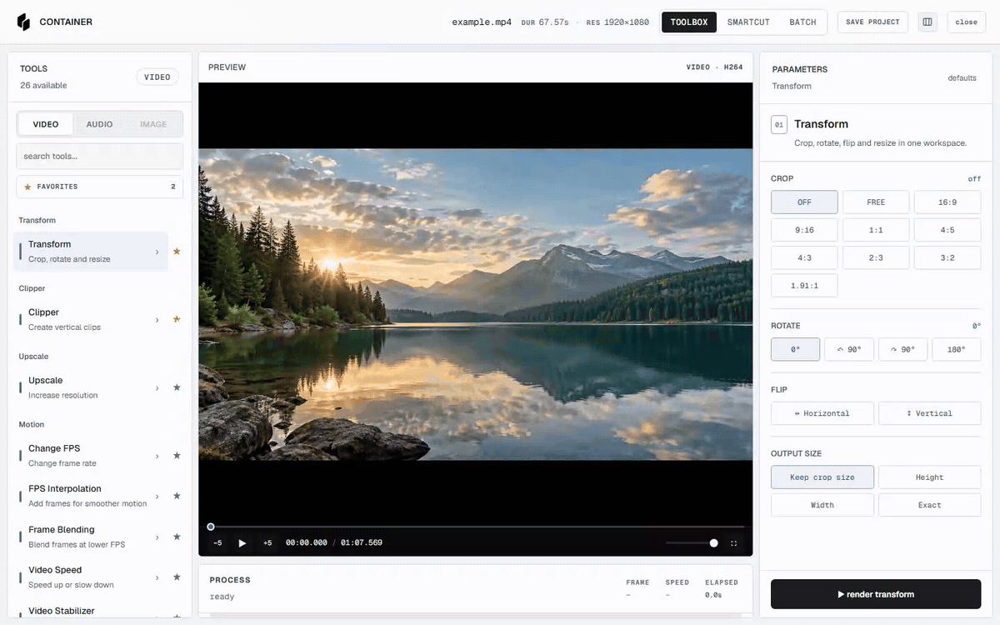

<h1 align="center">CONTAINER</h1>

  A Windows app for editing, converting and exporting video, audio and images. 
  It combines an FFmpeg toolbox, SmartCut, Clipper and batch processing.

  
  
  

  <a href="https://github.com/dewnn/container/releases/latest">Download the latest release</a> · <a href="https://github.com/dewnn/container/actions/workflows/ci.yml">Build status</a>

  

## Features

- Video, audio and image tools for conversion, resizing, cropping, speed, color, subtitles, overlays and export
- SmartCut silence detection with editable keep regions, timeline preview, MP4 and FCPXML export
- Clipper layouts, social tags and experimental automatic camera-region detection
- Batch processing, session recovery and hardware encoding with CPU fallback
- DWLNDR for supported downloads via bundled yt-dlp

Automatic camera-region detection is experimental. Review its selection before exporting.

## Install

Download `CONTAINER-Setup-<version>-x64.exe` from [Releases](https://github.com/dewnn/container/releases/latest). A portable ZIP is also available; extract it fully and keep its files together. Both packages include FFmpeg and FFprobe. The installer adds **Send to → CONTAINER** to Windows Explorer.

The app is not yet Authenticode-signed, so Windows SmartScreen may display an “Unknown publisher” warning.

## Premiere Pro connection

Prepared for v0.19.2. The optional connection targets **Premiere Pro 2025 and 2026 on Windows** using CEP 12. Real-host transfers have been checked on 2025 (25.5) and 2026; this is not a guarantee for every Adobe patch or workstation. Keep only one Premiere version running at a time.

**CONTAINER works normally without Premiere Pro.** Connecting is only required to use **Send to Premiere** after rendering.

1. In CONTAINER, open **Settings → Premiere Pro → Connect** and review the setup permission notice.
2. Restart Premiere once after setup. Keep Premiere open when you want to send a render.
3. A **green dot on Settings** and **Premiere connected** beside the completed render mean the connection is ready. **Send to Premiere** then becomes available.
4. Each send creates a **separate Premiere project** named after the rendered video, with a timeline matching its dimensions and frame rate. It never appends to the currently open timeline. Projects use Premiere's last project folder, with an Adobe-folder fallback. During transfer the connection row stays visible as **sending**; a slow response is not treated as an immediate disconnect.

Setup is normally needed only once. You can open Premiere after rendering; CONTAINER detects the connection automatically. You do not need to connect again for every render or app launch. Use **Update** when a CONTAINER update includes connection changes, then restart Premiere. **Disconnect** removes the connection.

Nothing is sent automatically, and CONTAINER does not launch Premiere for you. Setup enables Adobe's unsigned-extension permission for your user account; read the notice before accepting. See [connection details and limitations](docs/PREMIERE_BRIDGE.md).

## Behavior and privacy

Processing runs locally. CONTAINER does not upload media or collect analytics. Outputs are saved separately under `Downloads/CONTAINER Output`; source files are not overwritten.

Closing the window leaves CONTAINER in the notification area, allowing active jobs to continue. Use **Exit** from the tray menu to quit. Installed builds support signed updates; portable builds are updated manually.

See the [security notes](docs/SECURITY_AUDIT.md) for technical details.

## License and credits

CONTAINER is [MIT-licensed](LICENSE). FFmpeg and other bundled components retain their own licenses; see the [third-party notices](docs/THIRD_PARTY_NOTICES.md). SmartCut’s interface and Silero-based detection workflow were inspired by [cobanov/autocut](https://github.com/cobanov/autocut).

Built by **dewn**.
